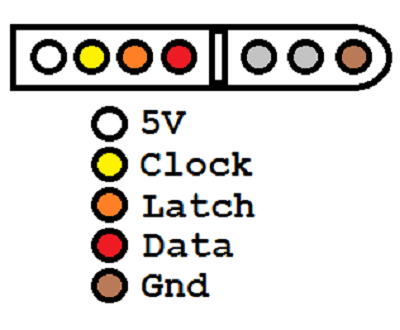

# usbasp4snes
4snes Snes controllers to USB adapter from Raphaël Assénat modified to run on a usbasp programmer. 
The original project can be found at:

http://www.raphnet.net/electronique/4nes4snes/index_en.php
# Pinout

The latch and clock pins are shared by all 4 controllers. Each controller has its own data pin tough.

| Programming Port | Snes Controller Pin |
| ------------- | ------------- |
| PORTD0 (RX)  | Latch   |
| PORTD1 (TX)  | Clock  |
| PORTB2 (RESET)  | Controller 1 Data  |
| PORTB3 (MOSI)  | Controller 2 Data  |
| PORTB4 (MISO)  | Controller 3 Data  |
| PORTB5 (SCK)  | Controller 4 Data  |
| VCC (5V)  | 5V  |
| Ground  | Ground  |

Snes controller pinout:

# Resistor Hack

The reistor in the TX pin (should be 270 ohm, but it is a 1K ohm in mine) needs to be bypassed. This is resistor R7 in my board. I simply used a piece of wire jumper to bypass it. This way I can remove the wire if I ever need the resistor again.
The RX and TX pins are not used by the official firmware anyway. Altough I read somewhere there support to serial in an alternative firmware. I always use a separate USB to serial adapter when needed.
